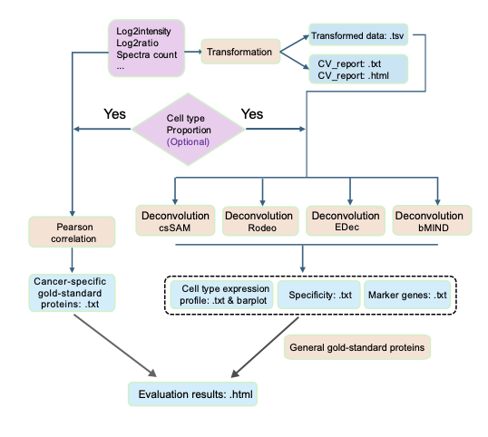

<!-- README.md is generated from README.Rmd. Please edit that file -->

Citation:
[Song Y, Zhou, Q, and Huang C. J Proteome Res. 2025](https://pubmed.ncbi.nlm.nih.gov/41328725/)

# ProTransDeconv
ProTransDeconv performs data transformation, coefficient of variation (CV) summarization, and identification of cell-type-specific proteins using protein quantification data derived from Mass Spectrometry (MS).

## WorkFlow

This is the workflow of the package：

<figure>

</figure>

<!-- badges: start -->
<!-- badges: end -->

## Installation

You can install the ProTransDeconv like so:

``` r
# install devtools if necessary
install.packages('devtools')

# install the ProTransDeconv package
devtools::install_github('HuangLabAtUAB/ProTransDeconv')

# load the ProTransDeconv package
library(ProTransDeconv)
```

## Example

This is a basic example which shows you how to run ProTransDeconv:

``` r
library(ProTransDeconv)
results <- ProTransDeconv(
    data = Protein_Quantification,
    type = "intensity", run_bmind = FALSE,
    cell_proportion = Cell_Type_Proportion
)
```

Result Explanation:

``` r
############## Output: results and summary_report.html ############## 

****** The result is a list containing the following elements ******

transformed_list: 
Protein expression matrices processed using different transformation methods.

cv_summary: 
A summary of the CV under different transformation methods, including mean, median, 
proportion greater than 0.25, and so on.

cv_plot_data: 
Gene-wise CV values across various transformation methods, used for visualization.

EDec, rodeo, csSAM, bMIND:  
If cell type proportions are provided, these contain the estimated 
cell-type-specific expression profiles and specificity scores using respective 
deconvolution methods under different transformations.

gene_cell_correlation: 
If cell type proportions are provided, this shows the correlation between cell 
type proportions and bulk protein expression across samples for each gene.

gold_standard_markers: 
If cell type proportions are provided, this includes the inferred gold-standard 
marker genes for each cell type based on correlation and significance thresholds.

****** The summary_report.html provides comprehensive report ******

The report includes a CV summary table and a density ridge plot. Additionally, 
if cell type proportions are provided, it also presents recall rates based on 
gold-standard markers and showcases examples of gene specificity across different cell types.

```
